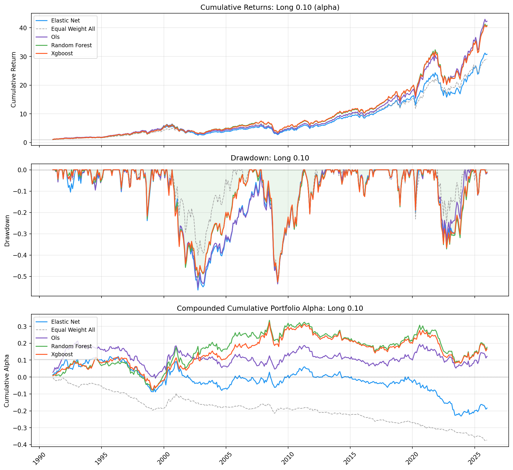
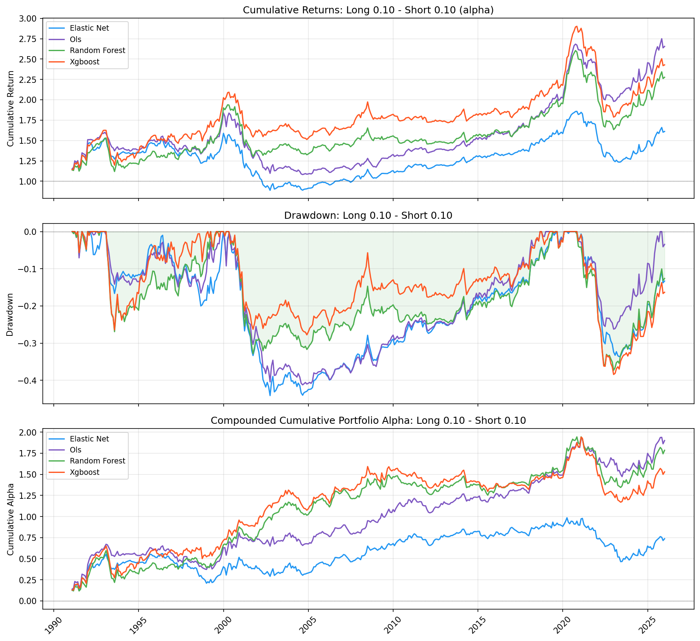

# Machine Learning Mutual Fund Selection

Can machine learning help identify mutual fund share classes that are more
likely to generate positive future alpha?

This project develops a systematic fund-selection research pipeline using CRSP
mutual fund data, fund characteristics, factor-adjusted realized alpha, and
walk-forward machine learning models. The goal is not to perfectly replicate a
single academic paper, but to test whether fund-level ML signals can be turned
into economically meaningful long-only or long-short selection strategies.

The research design is inspired by DeMiguel, Gil-Bazo, Nogales, and Santos
(2023), "Machine Learning and Fund Characteristics Help to Select Mutual Funds
with Positive Alpha," *Journal of Financial Economics* 150(3). This repository
is an independent reimplementation, not a faithful replication: the sample
construction, feature set, and backtest are similar in spirit but differ in
many details, and results are not directly comparable to the paper.

> Research project only. This is not investment advice.

## Research Idea

Most mutual fund studies ask whether managers generate alpha on average. This
project asks a more practical cross-sectional question:

```text
Given observable fund characteristics at year-end, can we rank funds by next
year's realized alpha?
```

The strategy logic is:

1. Estimate fund-level realized alpha using FF5+MOM factor adjustment.
2. Build annual features from fund characteristics and past performance.
3. Train models only on historical years.
4. Predict next-year fund alpha.
5. Form portfolios from the predicted ranking.
6. Evaluate whether the ranking produces positive alpha out of sample.

## Why This Is Hard

Mutual fund selection is a noisy prediction problem:

- True alpha is hard to estimate.
- Fund returns are highly exposed to common risk factors.
- CRSP mutual fund data contains missing classifications, stale fields, and
  extreme return outliers.
- Rolling alpha estimation can easily introduce look-ahead bias if timing is not
  handled carefully.
- A long-only strategy can look good simply because equity markets go up.

A large part of the project is therefore data timing, sample construction, and
backtest design rather than just model fitting.

## Methodology

### Target Variable

The main target is one-year-ahead realized alpha:

```text
target_alpha(t) = mean(monthly realized alpha in year t+1) * 12
```

Monthly realized alpha is computed using current-month fund returns and factor
realizations, but factor betas are estimated from the prior 36-month window. This
keeps beta estimation backward-looking and avoids using future information.

### Model Design

The model set includes:

- OLS
- Elastic Net
- Random Forest
- XGBoost

Models are trained using an expanding walk-forward design. For each test year,
the model only uses prior years for training. Hyperparameters are selected using
year-block time-series cross-validation, so validation years always come after
training years.

### Features

The annual feature panel includes:

- TNA
- Expense ratio
- Turnover
- Fund age
- Manager tenure
- Fund flows and flow volatility
- Value added
- Rolling alpha
- Alpha t-statistic
- FF5+MOM factor loading t-statistics
- Regression R-squared

Features are standardized within each annual cross-section.

### Sample Definition

The default universe focuses on active U.S. domestic equity mutual fund share
classes:

- Excludes ETFs and passive/index funds
- Keeps U.S. domestic equity objective codes
- Applies a no-load share-class screen
- Requires at least 70% equity allocation
- Excludes observations before the first month with at least $5 million TNA
- Requires sufficient return history before observations enter the final feature
  panel

CRSP/WRDS raw data is licensed and is not included in this repository.

## Strategy Construction

The backtest supports both long-only and long-short settings:

```python
LONG_DECILE = 0.10
SHORT_DECILE = 0.00  # long-only top 10%
```

or:

```python
LONG_DECILE = 0.10
SHORT_DECILE = 0.10  # top 10% - bottom 10%
```

Portfolios are formed annually:

- Rank funds at the end of year `t`
- Hold selected funds during year `t+1`
- Start each leg equal-weighted
- Do not rebalance monthly
- If a fund disappears, redistribute its weight across the remaining funds in
  that leg

For long-short portfolios, the strategy return is:

```text
top-ranked portfolio return - bottom-ranked portfolio return
```

## Current Findings

The current baseline uses:

```text
Target:        next-year realized alpha
Universe:      active U.S. domestic equity mutual fund share classes
Models:        OLS, Elastic Net, Random Forest, XGBoost
Backtest:      annual walk-forward portfolio formation
Strategies:    long-only top 10%; top 10% - bottom 10% long-short spread
Sample period: 1991-2025
```

The out-of-sample period starts in 1991 because `MIN_TRAIN_YEARS = 10` requires
ten prior years of fund-year observations before the first prediction, and the
usable panel begins in the early 1980s after the 36-month rolling-alpha window.

### Prediction Signal

The yearly information coefficient is modest but consistently positive. This is
important: the models do not produce unrealistically high ICs, but they do
appear to contain usable cross-sectional ranking information.

The IC table below is the summary of `data/processed/m_metrics_alpha.csv`
(per-year IC plus the aggregate rows), produced by `src/model.py`.

| Model | IC Mean | ICIR | % Years IC > 0 |
|---|---:|---:|---:|
| Elastic Net | 0.140 | 0.887 | 91.4% |
| OLS | 0.142 | 1.004 | 88.6% |
| Random Forest | 0.116 | 0.722 | 74.3% |
| XGBoost | 0.083 | 0.381 | 71.4% |

The IC levels are realistic for mutual fund selection. Earlier versions of this
project produced unrealistically high ICs, which helped uncover timing and
look-ahead issues in the alpha construction.

The ranking `OLS ≈ Elastic Net ≥ Random Forest > XGBoost` is itself
informative: the simple linear models do as well as or better than the tree
ensembles, which suggests the predictable component of next-year alpha in this
feature set is largely linear, and that the trees are mostly fitting noise at
the margin.

### Long-Only Strategy Snapshot

The long-only strategy invests in the top 10% of share classes by predicted
alpha and compares against an equal-weighted eligible-fund benchmark. The
strongest versions generate higher cumulative returns than the benchmark and
improve factor-adjusted alpha, although the alpha t-statistics are still not
strong enough to call the long-only strategy statistically robust on its own.

Config: `LONG_DECILE = 0.10`, `SHORT_DECILE = 0.00`, full period. Source:
`results/metrics_l10_s0_full.csv`. Ending wealth multiple is `1 + cum_return`.

| Model | Ending Wealth Multiple | Cumulative Alpha | Annual Return | Annualized Alpha | Alpha t-stat | Sharpe |
|---|---:|---:|---:|---:|---:|---:|
| Equal-Weight Eligible Funds | 29.0x | -37.4% | 10.10% | -1.32% | -3.80 | 0.54 |
| Elastic Net | 30.8x | -18.4% | 10.29% | -0.50% | -0.70 | 0.51 |
| OLS | 42.3x | 12.3% | 11.29% | 0.39% | 0.62 | 0.57 |
| Random Forest | 40.9x | 17.6% | 11.18% | 0.54% | 0.77 | 0.56 |
| XGBoost | 40.6x | 16.7% | 11.16% | 0.51% | 0.77 | 0.56 |

The long-only result is economically encouraging because OLS, Random Forest,
and XGBoost all improve cumulative return and cumulative alpha versus the
eligible-fund benchmark. Two caveats keep this honest. First, statistical
strength is weak: factor-adjusted alpha is positive, but the t-statistics
remain below 1. Second, the improvement is mostly in raw and factor-adjusted
return, not in risk-adjusted return: the Sharpe ratios (0.51-0.57) are barely
distinguishable from the benchmark's 0.54, and Elastic Net is actually slightly
below it. The long-only edge is real but small, and a lot of the cumulative
return simply reflects a rising equity market.



### Long-Short Strategy Snapshot

Latest top-decile minus bottom-decile results. Config: `LONG_DECILE = 0.10`,
`SHORT_DECILE = 0.10`, full period. Source: `results/metrics_l10_s10_full.csv`.

| Model | Cumulative Spread Return | Cumulative Alpha | Annualized Alpha | Alpha t-stat | Sharpe | Max Drawdown |
|---|---:|---:|---:|---:|---:|---:|
| Elastic Net | 61.1% | 73.6% | 1.81% | 1.45 | 0.20 | -44.1% |
| OLS | 165.6% | 190.1% | 3.27% | 2.71 | 0.36 | -41.2% |
| Random Forest | 127.7% | 178.6% | 3.15% | 2.60 | 0.31 | -37.3% |
| XGBoost | 142.9% | 153.0% | 2.89% | 2.30 | 0.33 | -38.4% |

These results suggest that the cross-sectional ranking signal is stronger in a
long-short spread than in a pure long-only portfolio. OLS, Random Forest, and
XGBoost all produce positive FF5+MOM-adjusted annual alpha with t-statistics
above 2 in the top-minus-bottom test. This is the clearest evidence that the
ranking signal is useful: the model is not just buying funds that rise with the
market; it is separating funds with better future alpha from funds with worse
future alpha.

The long-short backtest is best interpreted as a signal-quality test rather than
a directly tradable mutual fund strategy, because shorting mutual funds is
generally not practical.



## Main Insights

- Alpha prediction is possible but noisy. ICs are realistic rather than huge,
  so portfolio construction and validation design matter.
- The strategy signal is useful. Long-only top-decile portfolios improve
  cumulative return and cumulative alpha versus the eligible-fund benchmark,
  while long-short spreads show stronger factor-adjusted alpha evidence.
- The strongest evidence is cross-sectional. The long-short results indicate
  that predicted rankings separate better future-alpha funds from worse
  future-alpha funds.
- Sample construction has a large impact. Load screens, passive/index filters,
  CRSP objective codes, and equity-allocation fields materially change the
  universe.
- Correct timing is critical. Rolling betas must use only prior-month data, and
  annual targets must be aligned to next-year realized performance.
- Factor source matters less than expected. Using paper-provided factor files
  versus downloaded FF5+MOM factors changed some results, but did not fully
  explain strategy performance.

## Current Limitations

The project is still a research prototype. Important next checks include:

- Newey-West alpha t-statistics
- Subperiod analysis
- Long-leg and short-leg decomposition
- Turnover and implementation costs
- Minimum holding-count constraints
- Sensitivity to decile cutoffs
- Ensemble rankings across models
- Alpha-based hyperparameter tuning, so model selection is aligned with
  top-decile realized alpha rather than validation MSE alone
- Drawdown control and portfolio risk management, since the current strategy can
  experience large multi-year drawdowns

## Repository Layout

| Path | Description |
|---|---|
| [src/](src/) | Core Python pipeline. |
| [src/data_download.py](src/data_download.py) | Download raw CRSP tables and FF5/MOM factors from WRDS/Ken French. |
| [src/sample_filter.py](src/sample_filter.py) | Build the investable share-class sample using load, index/passive, equity, age, and TNA screens. |
| [src/features.py](src/features.py) | Estimate rolling FF5+MOM alpha, construct fund characteristics, and build annual targets. |
| [src/model.py](src/model.py) | Build annual model panel, run walk-forward OLS/ElasticNet/RF/XGBoost models, and report IC metrics. |
| [src/backtest.py](src/backtest.py) | Construct long-only and long-short portfolios, compute performance metrics, and generate plots. |
| [src/run_paper_factor_pipeline.py](src/run_paper_factor_pipeline.py) | Robustness run using the paper's factor files. |
| [src/main.py](src/main.py) | Pipeline orchestrator with step-level run toggles. |
| [data/](data/) | Raw and processed data. This folder is gitignored because CRSP/WRDS data is licensed. |
| [data/raw/](data/raw/) | Downloaded CRSP tables and factor files. |
| [data/processed/](data/processed/) | Filtered sample, feature panel, model predictions, IC metrics, and progress logs. |
| [results/](results/) | Backtest output tables and plots. |
| [results/plots/](results/plots/) | Cumulative return, drawdown, and cumulative alpha charts. |
| [pipeline_detailed_guide.md](pipeline_detailed_guide.md) | Step-by-step explanation of each script and parameter. |

[data/](data/) is not tracked in git because CRSP/WRDS data is licensed. Run
[src/data_download.py](src/data_download.py) with WRDS access to populate it.

## Reproducibility Notes

Install the core dependencies:

```bash
pip install pandas numpy scikit-learn xgboost matplotlib pandas-datareader wrds
```

Run the full pipeline:

```bash
python src/main.py
```

`src/main.py` exposes a `RUN_*` toggle for each stage at the top of the file, so
individual steps can be enabled or skipped. Each stage can also be run on its
own (`python src/sample_filter.py`, `python src/features.py`, etc.). WRDS access
is required to download the raw CRSP mutual fund data; if raw data is already
available locally, leave `RUN_DATA_DOWNLOAD = False`. See
`pipeline_detailed_guide.md` for what each stage reads, writes, and when it
needs to be re-run.

## Reference

DeMiguel, V., Gil-Bazo, J., Nogales, F. J., & Santos, A. A. P. (2023).
[Machine learning and fund characteristics help to select mutual funds with
positive alpha](https://doi.org/10.1016/j.jfineco.2023.103737). *Journal of
Financial Economics*, 150(3), 103737.

## Disclaimer

This repository is for academic and research purposes only. Backtest results are
not evidence of future performance and should not be interpreted as investment
advice.
